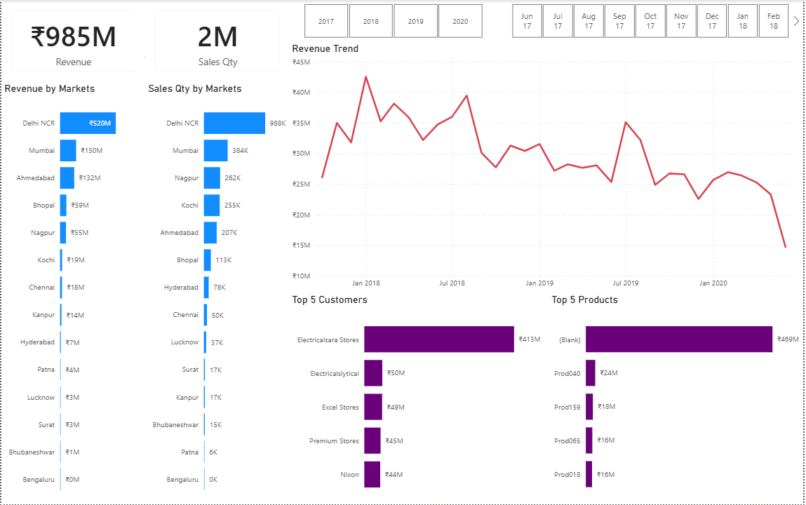
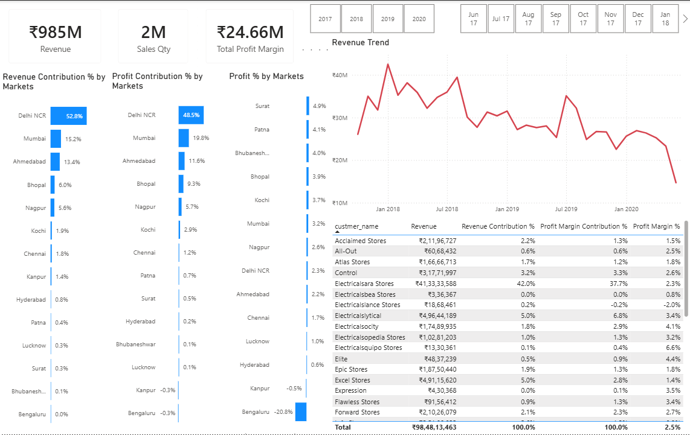
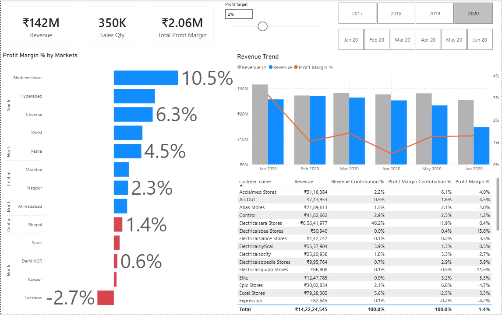
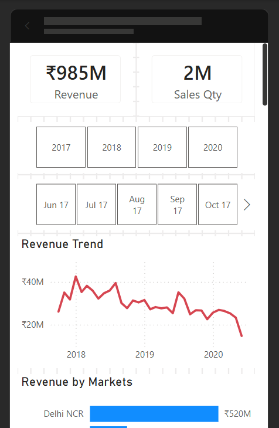
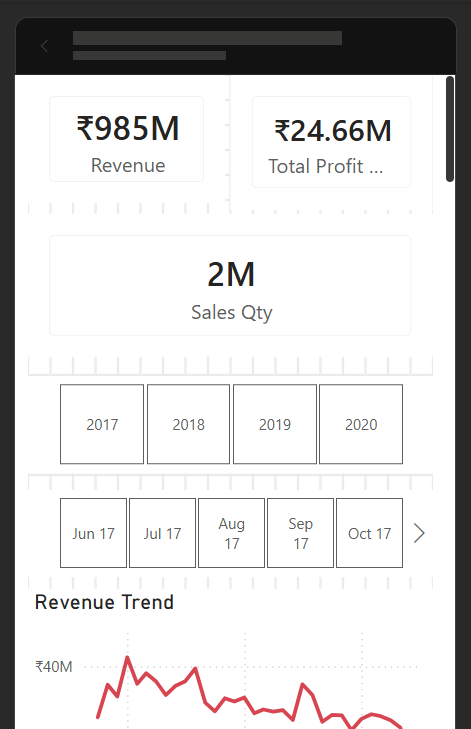
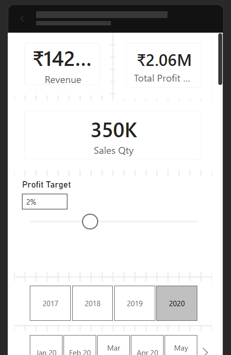

# 📊 End-to-End Sales Insights Dashboard using SQL & Power BI

## Project Overview

This project analyzes sales data of a computer hardware company using **Power BI** to identify revenue trends, customer performance, product performance, and market-wise sales insights.

The project follows an end-to-end Business Intelligence workflow, including SQL data exploration, data cleaning with Power Query, data modeling, DAX calculations, and interactive dashboard development.

---

## Business Problem

The sales team relied on static reports, making it difficult to quickly identify revenue trends and business opportunities.

This analysis answers questions such as:

* Which markets generate the highest revenue?
* Which customers contribute the most sales?
* Which products perform the best?
* How does revenue change over time?
* Which regions require business attention?
* How can management monitor sales performance through interactive dashboards?

---

## Dataset

**Source:** Codebasics Sales Insights Project Dataset

The dataset includes information about:

* Customers
* Products
* Markets
* Transactions
* Date Table

---

## Tools Used

* Power BI
* Power Query
* DAX
* MySQL
* Microsoft Excel
* Git & GitHub

---

## Project Structure

```text
sales-insights-sql-powerbi/
│
├── Dataset/
|   ├── db_dump.sql
|   └── db_dump_version_2.sql
│
├── SQL/
│   └── SQL_analysis.sql
│
├── Dashboard/
│   └── Sales_Insight_Dashboard.pbix
│
├── Images/
|   ├── Key Insights Page.png
|   ├── Profit Analysis Page.png
|   ├── Performance-Insights Page.png
|   ├── mobile-dashboard-1.png
|   ├── mobile-dashboard-2.png
|   └── mobile-dashboard-3.png
│
└── README.md
```

---

## SQL Exploration

Before building the dashboard, the dataset was explored using MySQL to better understand the business data and validate records.

The SQL scripts include analysis for:

* Database exploration
* Revenue analysis
* Sales quantity analysis
* Customer analysis
* Product analysis
* Market analysis
* Currency validation
* Data verification

> All SQL queries used in this project are available in the **SQL/** folder.

---

## Data Preparation

The following transformations were completed using **Power Query**:

* Removed duplicate records
* Removed null values
* Corrected data types
* Standardized currency values
* Filtered invalid transactions
* Cleaned inconsistent records
* Built relationships between tables
* Prepared the data model for reporting

---

## Dashboard

The Power BI dashboard includes:

* Revenue Analysis
* Revenue by Market
* Sales Quantity by Market
* Top Customers
* Top Products
* Revenue Trend Analysis
* KPI Cards
* Interactive Filters & Slicers

---

## DAX Measures

Some of the measures created include:

* Total Revenue(Revenue)
* Total Sales Quantity(Sales Qty)
* Total Profit Margin
* Profit Margin %
* Profit Margin Contribution %
* Revenue Contribution %
* Revenue LY(Last Year)
* Target Diff
* Dynamic KPI Calculations

---

## Key Insights

* Delhi NCR was the highest revenue-generating market, contributing approximately **₹520M** in sales, followed by Mumbai and Ahmedabad.
* The company generated approximately **₹985M in revenue** from **2M units sold** during the analysis period.
* Revenue showed a gradual decline toward 2020, indicating a potential slowdown in sales performance.
* **Electricalsara Stores** emerged as the top customer, contributing the highest revenue among all customers.
* Delhi NCR contributed over **50% of total revenue**, making it the company's most important market.
* Profit margin analysis revealed that while some markets delivered strong profitability, others recorded low or negative profit margins, highlighting opportunities for business improvement.

---

## Recommendations

* Focus on expanding sales in high-performing markets while improving performance in underperforming regions.
* Investigate the reasons behind declining revenue trends and optimize sales strategies accordingly.
* Strengthen relationships with high-value customers through targeted retention initiatives.
* Monitor low-profit markets and review pricing or operational costs to improve profitability.
* Improve data quality by addressing missing or uncategorized product records.

---

## Dashboard Preview

### Key Insights Page



### Profit Analysis Page



### Performance Insights Page



## 📱 Mobile Dashboard Views

<table>
<tr>
<td align="center">
<b>Key Insights</b><br>

</td>

<td align="center">
<b>Profit Analysis</b><br>

</td>

<td align="center">
<b>Performance Insights</b><br>

</td>
</tr>
</table>

## Dashboard Demo

Watch a short walkthrough of the interactive Power BI dashboard by clicking the link below.

**[Watch on LinkedIn](https://www.linkedin.com/posts/your-post-link/)**

---

## What I Learned

This project helped me develop practical skills in:

* SQL Data Exploration
* Data Cleaning using Power Query
* Data Modeling
* Writing DAX Measures
* Power BI Dashboard Development
* Business Intelligence Reporting
* Data Visualization
* Git & GitHub

---

## Future Improvements

* Add advanced DAX calculations
* Publish the dashboard to Power BI Service
* Implement Row-Level Security (RLS)
* Add forecasting visuals
* Improve dashboard design and user experience

---

## Acknowledgements

This project was completed by following the **Codebasics Power BI Sales Insights** project, which provided valuable hands-on experience in Business Intelligence and Power BI development.

---

## Author

**Pratipalsinh Rana**

* GitHub: *https://github.com/Pratipalsinh3397*
* LinkedIn: *www.linkedin.com/in/pratipalsinh-rana*

If you found this project useful, consider ⭐ starring the repository.
